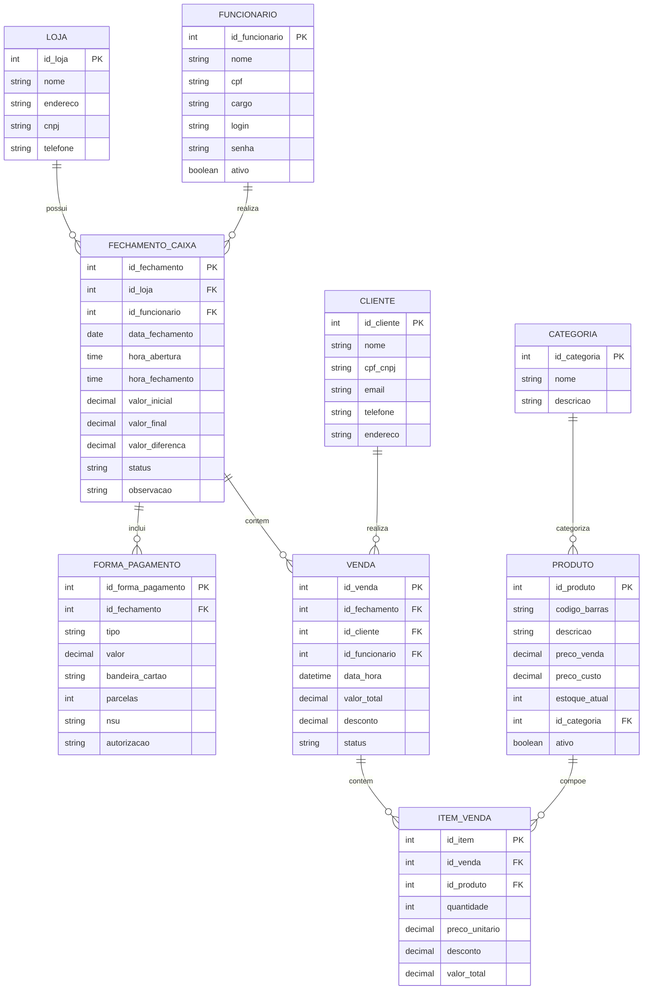

# Clausonus - Sistema de Fechamento de Loja

## Visão Geral

Clausonus é um sistema moderno para gerenciamento e fechamento de caixas em redes de lojas varejistas. Desenvolvido com arquitetura de microsserviços usando tecnologias Java modernas, o sistema proporciona uma solução escalável, robusta e de fácil manutenção.

## Arquitetura

O sistema utiliza uma arquitetura de microsserviços, com cada componente funcionando de forma independente e se comunicando através de uma API Gateway e um barramento de eventos (Event Bus).

### Diagrama de Microsserviços

```mermaid
flowchart TB
    subgraph MS-LOJAS["Microsserviço de Lojas"]
        LojaDB[(Banco de Dados\nLoja)]
        LojaAPI[API de Lojas]
        LojaAPI --- LojaDB
    end

    subgraph MS-FUNCIONARIOS["Microsserviço de Funcionários"]
        FuncionarioDB[(Banco de Dados\nFuncionário)]
        FuncionarioAPI[API de Funcionários]
        FuncionarioAPI --- FuncionarioDB
    end

    subgraph MS-CLIENTES["Microsserviço de Clientes"]
        ClienteDB[(Banco de Dados\nCliente)]
        ClienteAPI[API de Clientes]
        ClienteAPI --- ClienteDB
    end

    subgraph MS-PRODUTOS["Microsserviço de Produtos"]
        ProdutoDB[(Banco de Dados\nProduto)]
        CategoriaDB[(Banco de Dados\nCategoria)]
        ProdutoAPI[API de Produtos]
        ProdutoAPI --- ProdutoDB
        ProdutoAPI --- CategoriaDB
    end

    subgraph MS-VENDAS["Microsserviço de Vendas"]
        VendaDB[(Banco de Dados\nVenda)]
        ItemVendaDB[(Banco de Dados\nItem Venda)]
        VendaAPI[API de Vendas]
        VendaAPI --- VendaDB
        VendaAPI --- ItemVendaDB
    end

    subgraph MS-PAGAMENTOS["Microsserviço de Pagamentos"]
        PagamentoDB[(Banco de Dados\nForma Pagamento)]
        PagamentoAPI[API de Pagamentos]
        PagamentoAPI --- PagamentoDB
    end

    subgraph MS-FECHAMENTO["Microsserviço de Fechamento de Caixa"]
        FechamentoDB[(Banco de Dados\nFechamento)]
        FechamentoAPI[API de Fechamento]
        FechamentoAPI --- FechamentoDB
    end

    %% API Gateway
    Gateway[API Gateway]

    %% Barramento de Eventos
    EventBus[Event Bus / Message Broker]

    %% Conexões com Gateway
    Gateway --- MS-LOJAS
    Gateway --- MS-FUNCIONARIOS
    Gateway --- MS-CLIENTES
    Gateway --- MS-PRODUTOS
    Gateway --- MS-VENDAS
    Gateway --- MS-PAGAMENTOS
    Gateway --- MS-FECHAMENTO

    %% Conexões entre microsserviços via Event Bus
    MS-FECHAMENTO --- EventBus
    MS-VENDAS --- EventBus
    MS-PAGAMENTOS --- EventBus
    MS-LOJAS --- EventBus
    MS-FUNCIONARIOS --- EventBus
    MS-CLIENTES --- EventBus
    MS-PRODUTOS --- EventBus

    %% Clientes externos
    Frontend[Frontend da Aplicação] --- Gateway
    Mobile[Aplicativo Mobile] --- Gateway
    
    classDef gateway fill:#f96,stroke:#333,stroke-width:2px;
    classDef bus fill:#6a9,stroke:#333,stroke-width:2px;
    classDef external fill:#acf,stroke:#333,stroke-width:2px;
    class Gateway gateway;
    class EventBus bus;
    class Frontend,Mobile external;
```



## Módulos do Sistema

O sistema é composto pelos seguintes microsserviços:

### 1. Microsserviço de Lojas
Gerencia as informações relacionadas às lojas físicas da rede.
- **Entidades principais**: Loja
- **APIs principais**: CRUD de lojas

### 2. Microsserviço de Funcionários
Gerencia dados dos funcionários e controle de acesso.
- **Entidades principais**: Funcionário
- **APIs principais**: CRUD de funcionários, autenticação, gestão de acesso

### 3. Microsserviço de Clientes
Gerencia o cadastro de clientes e suas interações.
- **Entidades principais**: Cliente
- **APIs principais**: CRUD de clientes, consulta de histórico

### 4. Microsserviço de Produtos
Gerencia o catálogo de produtos e estoque.
- **Entidades principais**: Produto, Categoria
- **APIs principais**: CRUD de produtos, consulta de estoque

### 5. Microsserviço de Vendas
Registra as vendas realizadas e seus itens.
- **Entidades principais**: Venda, ItemVenda
- **APIs principais**: Registro de vendas, consulta de vendas

### 6. Microsserviço de Pagamentos
Gerencia as formas de pagamento e transações.
- **Entidades principais**: FormaPagamento
- **APIs principais**: Processamento de pagamentos, conciliação

### 7. Microsserviço de Fechamento de Caixa
Coordena o processo de fechamento diário de caixa.
- **Entidades principais**: FechamentoCaixa
- **APIs principais**: Abertura/fechamento de caixa, relatórios

## Modelo de Dados

O sistema utiliza um modelo de banco de dados relacional distribuído, com cada microsserviço mantendo seu próprio banco. Abaixo está o diagrama ER do sistema:



## Tecnologias Utilizadas

O sistema utiliza uma stack moderna de tecnologias:

- **Backend**: Java 17, Quarkus, Hibernate ORM com Panache
- **Frontend**: (Em desenvolvimento)
- **Banco de Dados**: PostgreSQL (produção), H2 (desenvolvimento/testes)
- **Comunicação**: RESTful APIs, Apache Kafka (Event Bus)
- **Autenticação**: JWT
- **Documentação**: Swagger/OpenAPI
- **Containerização**: Docker, Docker Compose
- **CI/CD**: (Em implementação)
- **Monitoramento**: (Em implementação)

## Configuração de Desenvolvimento

### Requisitos

- Java 17 ou superior
- Maven 3.8 ou superior
- Docker e Docker Compose (opcional, para ambiente completo)

### Execução

1. Clone o repositório:
```bash
git clone https://github.com/your-organization/clausonus.git
cd clausonus
```

2. Execute o script de inicialização do ambiente de desenvolvimento:
```bash
# Dar permissão de execução ao script
chmod +x dev-start.sh

# Executar o script
./dev-start.sh
```

3. O script oferecerá a opção de iniciar o ambiente com Docker ou localmente.

### Acesso aos serviços

- **API Loja**: http://localhost:8080/clausonus/api/lojas
- **Swagger UI**: http://localhost:8080/clausonus/swagger-ui/
- **PgAdmin** (se usando Docker): http://localhost:5050
  - Email: admin@clausonus.com.br
  - Senha: admin

## Testes

Para executar os testes automatizados:

```bash
mvn test
```

Para testar endpoints específicos da API, use o script de teste disponibilizado:

```bash
# Dar permissão de execução ao script
chmod +x test-loja-api.sh

# Executar o script
./test-loja-api.sh
```

## Licença

Este projeto está licenciado sob a licença Apache 2.0 - consulte o arquivo LICENSE para obter detalhes.